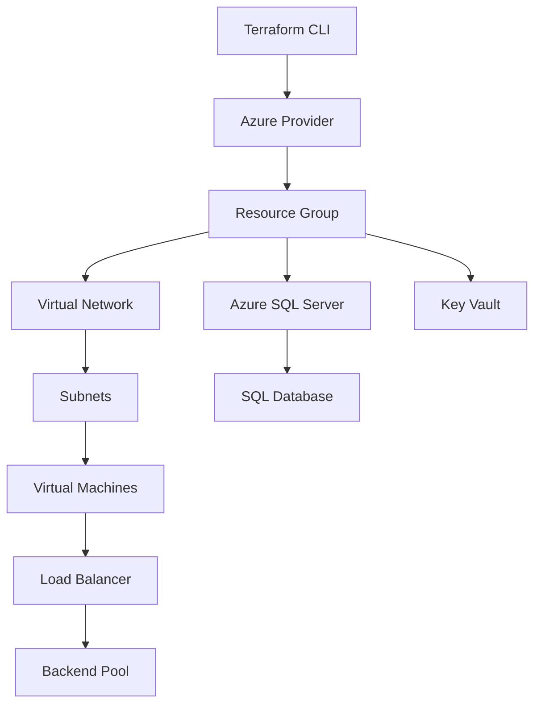

<p align="center">
  
</p>

<p align="center">
  
</p>

<p align="center">
  
  
  
  
</p>

---

## 🚀 Overview

This repository contains **generic, reusable Terraform modules** for provisioning **Microsoft Azure infrastructure**.  
The goal of this project is to provide **production-ready building blocks** that can be reused across multiple environments like **dev, test, staging, and prod**.

Each module is **independent, cleanly structured, and designed using Terraform best practices**.

---

## 🧱 Modules Included

```text
✔ Resource Group
✔ Virtual Network
✔ Public IP
✔ Virtual Machine
✔ Load Balancer
✔ Load Balancer Association
✔ Azure SQL Server
✔ Azure SQL Database
✔ Azure Key Vault
✔ Key Vault Secrets
```

---

## 📁 Repository Structure

```bash
Infrastructure_generic/
├── Env/                         # Environment-specific configurations
└── module/
    ├── resource_group/
    ├── virtual_network/
    ├── public_ip/
    ├── virtual_machine/
    ├── loadbalancer/
    ├── load_association/
    ├── mssql_server/
    ├── mssql_database/
    ├── key_vault/
    └── key_secret/
```

---

## ⚙️ Design Principles

- 🔹 **Modular Terraform design**
- 🔹 Reusable across multiple projects
- 🔹 Clean variable definitions & outputs
- 🔹 Environment-agnostic modules
- 🔹 Supports CI/CD & GitOps workflows
- 🔹 Follows Azure naming & security best practices

---

## 🧠 Example Usage

```hcl
module "rg" {
  source   = "../module/resource_group"
  rg_name  = "prod-rg"
  location = "West Europe"
}

module "vnet" {
  source   = "../module/virtual_network"
  vnet_name = "prod-vnet"
  rg_name   = module.rg.rg_name
}
```

---

## 🏗️ Conceptual Architecture (3D Flow)



---

## 🔐 Security & Best Practices

- Secrets managed via **Azure Key Vault**
- No hardcoded credentials
- `.tfstate` handled per environment
- Ready for **remote backend integration**
- Suitable for enterprise Azure Landing Zones

---

## 📌 Use Cases

- Enterprise Azure projects
- DevOps automation pipelines
- Azure Landing Zone foundations
- Reusable Terraform library
- Interview & portfolio projects

---

## 👨‍💻 Author

**Tushar Mishra**  
DevOps Engineer | Azure | Terraform  
📧 Email: tusharmishra2902@gmail.com  
🔗 LinkedIn: https://linkedin.com/in/tushar-mishra-02461235a  
🐙 GitHub: https://github.com/tushar-2902  

---

## 📜 License

This project is licensed under the **MIT License**.

---

