<!-- 🌟 3D Styled Header Banner -->
<p align="center">
  
</p>

<!-- ⌨️ Typing Animation -->
<p align="center">
  
</p>

<!-- 🔰 Badges -->
<p align="center">
  
  
  
  
</p>

---

## 🚀 Project Overview

This project demonstrates **provisioning an AWS EC2 instance with an Elastic IP (EIP)** using **Terraform**.  
Elastic IP provides a **static public IPv4 address**, ensuring consistent connectivity even after instance restarts.

The project follows **Infrastructure as Code (IaC)** principles and reflects a **real-world DevOps automation use case**.

---

## 🧩 Components Provisioned

- 🖥️ AWS EC2 Instance  
- 🌐 Elastic IP (VPC scoped)  
- 🔗 Elastic IP association with EC2  
- 🏷️ Resource tagging using Terraform  
- ⚙️ AWS Provider configuration  

---

## 📂 Repository Structure

```bash
aws_folder/
├── EC2_instances/
│   ├── EC2.tf
│   └── provider.tf
├── elastic_ip/
│   ├── elastic_ip.tf
│   ├── association_eip.tf
│   ├── ec2.tf
│   ├── provider.tf
│   └── terraform.tfstate
└── README.md
```

---

## ⚙️ Key Terraform Snippets

```hcl
resource "aws_eip" "static_ip" {
  domain = "vpc"

  tags = {
    Name = "tushar-elastic-ip"
  }
}
```

```hcl
resource "aws_eip_association" "attach_eip" {
  instance_id   = aws_instance.example.id
  allocation_id = aws_eip.static_ip.id
}
```

---

## 🏗️ Architecture Flow

```mermaid
graph TD
    A[Terraform CLI] --> B[AWS Provider]
    B --> C[EC2 Instance 🖥️]
    B --> D[Elastic IP 🌐]
    D --> E[EIP Association 🔗]
    E --> C
```



---

## 🧪 How to Run

```bash
# Configure AWS credentials
aws configure

# Initialize Terraform
terraform init

# Validate configuration
terraform validate

# Review execution plan
terraform plan

# Create infrastructure
terraform apply -auto-approve

# Cleanup resources (optional)
terraform destroy -auto-approve
```

---

## 🛡️ Best Practices Followed

- Infrastructure as Code (IaC)
- Separation of resources into logical files
- Static public IP allocation using Elastic IP
- Clean, readable Terraform configuration
- Suitable for CI/CD & automation pipelines

---

## 👨‍💻 Author

**Tushar Mishra**  
DevOps Engineer | AWS | Terraform  
📧 Email: tusharmishra2902@gmail.com  
🔗 LinkedIn: https://linkedin.com/in/tushar-mishra-02461235a  
🐙 GitHub: https://github.com/tushar-2902  

---

## 📜 License

Licensed under the **MIT License**.

---

<p align="center">
  
</p>
